# 🤖 InsureYouAI - Yapay Zeka Destekli Sigorta Yönetim Platformu

## 📋 İçindekiler
- [Proje Özeti](#proje-ozeti)
- [Önemli Özellikler](#onemli-ozellikler)
- [Teknoloji Stack](#teknoloji-stack)
- [Sistem Mimarisi](#sistem-mimarisi)
- [Kurulum ve Yapılandırma](#kurulum-ve-yapilandirma)
- [Veritabanı Yapısı](#veritabani-yapisi)
- [Modüller ve Özellikler](#moduller-ve-ozellikler)
- [API Entegrasyonları](#api-entegrasyonlari)
- [Kullanıcı Yönetimi](#kullanici-yonetimi)
- [Proje Yapısı](#proje-yapisi)
- [Ekran Görüntüleri](#ekran-goruntuleri)

---

## 💡 Proje Özeti

**InsureYouAI**, yapay zeka teknolojilerini kullanarak sigorta hizmetlerinin yönetimini, analiz edilmesini ve öneriler sunulmasını sağlayan modern bir ASP.NET Core web uygulamasıdır. Proje, OpenRouter API'si aracılığıyla çeşitli AI modelleri ile entegre çalışır ve kullanıcılara kişiselleştirilmiş sigorta önerileri sunar.

### Hedef Kullanıcılar:
- 🏢 Sigorta şirketleri ve aracıları
- 👨‍💼 Sigorta müşteri danışmanları
- 📊 İdari ve yönetici personeli
- 📱 Bireysel sigorta düşünen kullanıcılar

### Ana Amaçlar:
1. Sigorta poliçelerinin dijital yönetimi
2. AI'ın kullanarak müşteri önerileri
3. Sigorta satış tahminleri
4. Müşteri iletişim merkezi
5. Fotoğraf ve belge analizi

---

## ✨ Önemli Özellikler

### 🤖 Yapay Zeka Özellikleri
- **AI Sohbet Desteği**: OpenRouter API üzerinden gerçek zamanlı AI sohbeti
- **Sigorta Tavsiyesi**: Kişiselleştirilmiş sigorta poliçesi önerileri
- **Metin Kategorileştirme**: İnsan AI'sı ile otomatik kategori tespiti
- **PDF Analizi**: Sigorta belgesi ve poliçe dokümantasyonunun AI tarafından analiz edilmesi
- **İmaj Üretimi**: DALL-E API entegrasyonu ile AI görsel oluşturma
- **Ses Sentezi**: ElevenLabs API ile metin-konuşma dönüştürme
- **Polis Tahmin Etme**: Microsoft ML.NET ile sigorta satışı tahmin modeli

### 📊 Analitik ve Raporlama
- **Dashboard**: Gerçek zamanlı satış ve gelir grafiği
- **Tahmin Sistemi**: Zaman serisi analizi ile gelecek satış projeksiyonları
- **Grafiksel Raporlar**: ApexCharts ve Highcharts kullanarak interaktif grafikler
- **Kategoriye Göre Analiz**: Sigorta türlerine göre detaylı istatistikler

### 💬 İletişim Sistemi
- **SignalR ile Gerçek Zamanlı Chat**: Müşteri-danışman canlı sohbeti
- **Mesaj Yönetimi**: Gelen/Giden mesaj takibi
- **İletişim Formu**: Müşteri sorularının toplanması
- **Email Entegrasyonu**: MailKit ile otomatik email gönderimi

### 📧 İçerik Yönetimi
- **Blog Sistemi**: Makale yayınlama ve kategori yönetimi
- **Makaleler**: Sigorta bilgileri hakkında yazılı içerik
- **Hizmetler**: Sigorta ürünlerinin tanıtılması
- **Fiyatlandırma Planları**: Farklı sigorta paketlerinin yönetimi
- **Testimoniallar**: Müşteri görüş ve deneyimleri
- **Slider/Döngü**: Ana sayfada dinamik görseller

### 👤 Kullanıcı Yönetimi
- **ASP.NET Core Identity**: Güvenli kullanıcı kimlik doğrulama
- **Rol Tabanlı Erişim**: Admin, Moderatör, Müşteri rolleri
- **Kullanıcı Profili**: Detaylı profil bilgileri ve sigorta geçmişi
- **Şifre Sıfırlama**: Güvenli şifre kurtarma mekanizması

### 📱 Yönetim Paneli
- **Responsive Admin Dashboard**: Mobil uyumlu yönetim arayüzü
- **Hızlı İstatistikler**: Özelleştirilebilir widget'lar
- **Veri Tabloları**: DataTables ile dinamik liste yönetimi
- **Dosya Yönetimi**: Drag-and-drop ile örnek yükleme
- **PDF Dönüştürme**: Belge yönetimi

---

## 🏗️ Teknoloji Stack

### Backend
- **Framework**: ASP.NET Core 9.0
- **Dil**: C#
- **ORM**: Entity Framework Core 9.0.7
- **Veritabanı**: SQL Server
- **Web API**: OpenRouter, ElevenLabs

### Frontend
- **HTML5 / CSS3**
- **JavaScript**
- **Bootstrap 5**: Responsive tasarım
- **jQuery**: DOM manipülasyonu
- **ApexCharts / Highcharts**: Grafikler
- **DataTables**: Veri tabloları
- **Swiper**: Galeri slider

### Gerçek Zamanlı İletişim
- **SignalR**: WebSocket tabanlı canlı sohbet

### Machine Learning
- **Microsoft ML.NET 5.0**: Zaman serisi tahmin modeli
- **ml.net Time Series**: Satış tahminlemesi

### Kütüphaneler
- **MailKit 4.17.0**: Email gönderimi
- **PdfPig 0.1.15**: PDF işleme
- **X.PagedList 10.5.9**: Sayfalandırma
- **Identity 2.3.11**: Kullanıcı yönetimi

---

## 🏰 Sistem Mimarisi

```
┌─────────────────────────────────────────────────────────────┐
│                    Web Arayüzü (Frontend)                   │
│         HTML/CSS/JavaScript + Bootstrap + jQuery             │
└────────────────────────┬────────────────────────────────────┘
						 │
		┌────────────────┴────────────────┐
		│                                 │
   ┌────▼─────────────┐     ┌────────────▼──────┐
   │  ASP.NET Core    │     │   Real-time       │
   │  Controllers     │─────│   Chat (SignalR)  │
   │  & Views         │     └───────────────────┘
   └────┬─────────────┘
		│
   ┌────▼──────────────────────────────────┐
   │   İş Mantığı Katmanı                   │
   │  ├─ AIService (OpenRouter entegrasyonu)│
   │  ├─ ForecastService (Tahmin modeli)    │
   │  ├─ Vision Service (Image Generation)  │
   │  └─ ChatHub (SignalR Hub)              │
   └────┬──────────────────────────────────┘
		│
   ┌────▼──────────────────────────────────┐
   │  Veri Erişim Katmanı (Entity Framework)│
   │  InsureContext - DbContext             │
   └────┬──────────────────────────────────┘
		│
   ┌────▼──────────────────────────────────┐
   │     SQL Server Veritabanı              │
   │     InsureYouAIDb                      │
   └───────────────────────────────────────┘
		│
   ┌────▼──────────────────────────────────┐
   │   Harici API Entegrasyonları           │
   │  ├─ OpenRouter (AI Models)             │
   │  ├─ ElevenLabs (Text-to-Speech)        │
   │  ├─ Tavily Search (Araştırma)          │
   │  └─ DALL-E (Image Generation)          │
   └───────────────────────────────────────┘
```

---

## 📦 Kurulum ve Yapılandırma

### Adım 1: Projeyi Klonlayın
```bash
git clone https://github.com/ComputerUni/InsureYouAI.git
cd InsureYouAI
```

### Adım 2: NuGet Paketlerini Yükleyin
```bash
dotnet restore
```

### Adım 3: Veritabanını Yapılandırın
**appsettings.json** dosyasında bağlantı stringini düzenleyin:
```json
{
  "ConnectionStrings": {
	"DefaultConnection": "Server=YOUR_SERVER;Initial Catalog=InsureYouAIDb;Integrated Security=True;TrustServerCertificate=True"
  }
}
```

### Adım 4: Veritabanı Migrasyon
```bash
dotnet ef migrations add InitialCreate
dotnet ef database update
```

### Adım 5: API Anahtarlarını Yapılandırın
**appsettings.Development.json** dosyasından:
```json
{
  "APIs": {
	"OpenRouterKey": "YOUR_OPENROUTER_API_KEY",
	"ElevenLabsKey": "YOUR_ELEVENLAB_API_KEY",
	"TavilyKey": "YOUR_TAVILY_API_KEY"
  }
}
```

### Adım 6: Uygulamayı Çalıştırın
```bash
dotnet run
```
Uygulama: `https://localhost:5001` adresinden erişilebilir

---

## 🗄️ Veritabanı Yapısı

### Ana Tablolar

#### 1. **About / AboutItem**
- Şirket hakkında bilgileri depolama

#### 2. **Article**
- Bilgilendirici makaleler
- Kategoriye göre sınıflandırma

#### 3. **Category**
- Sigorta ve makale kategorileri
- Ad ve açıklamalar

#### 4. **AppUser** (Identity)
- Kullanıcı bilgileri
- Şifre ve güvenlik
- Profil detayları

#### 5. **Policy**
- Sigorta poliçeleri
- Poliçe türü, başlangıç/bitiş tarihleri
- Prim bilgileri

#### 6. **Contact**
- Müşteri iletişim bilgileri
- Adres ve telefon

#### 7. **Message**
- Müşteri-danışman mesajları
- Tarih ve okunma durumu

#### 8. **PricingPlan / PricingPlanItem**
- Fiyatlandırma paketleri
- Paket özellikleri

#### 9. **Comment**
- Blog makalelerine yapılan yorumlar

#### 10. **AIMessage**
- AI sohbet geçmişi
- Sorular ve cevaplar

#### 11. **Revenue / Expense**
- Gelir ve gider takibi
- Mali raporlama

#### 12. **Testimonial**
- Müşteri görüşleri
- Puan ve değerlendirme

#### 13. **Slider / TrailerVideo**
- Görseller ve videolar
- Ana sayfa içerikleri

---

## 🎯 Modüller ve Özellikler

### 1. 🏠 Ana Sayfa (Default)
**Dosya**: `Views/Default/Index.cshtml`

**Bileşenler**:
- Dinamik slider/reklam alanı
- Hizmetler vitrin
- Şirket hakkında bilgileri
- Fiyatlandırma paketi gösterileri
- Müşteri yorumları
- Blog yazılarının son 3'ü
- İletişim formu

### 2. 📚 Blog Sistemi
**Controller**: `BlogController.cs`
**ViewComponents**:
- Blog listesi (kategori filtrelemesi)
- Blog detayı (yorumlar dahil)
- Sidebar (son 3 yazı, yetkili yazarlar)

**Özellikler**:
- Açıklamalar ve etiketler
- Kategoriye göre filtreleme
- Kullanıcı yorumları
- Yazı arama

### 3. 🤖 AI Sohbet Modülü
**Controller**: `ChatController.cs`
**View**: `ChatWithAI.cshtml`

**İşlevler**:
- OpenRouter API ile gerçek zamanlı sohbet
- SignalR üzerinden yazıyor göstergesi
- Sohbet geçmişi saklaması
- Kategori tespiti (sorulara otomatik yapılır)

**API Entegrasyonu**:
```csharp
model: "openrouter/free"
Temperature: 0.7
System Prompt: Sigorta danışmanı rolü
```

### 4. 📊 Yönetim Paneli (Dashboard)
**Controller**: `DashboardController.cs`
**View**: `Dashboard/Index.cshtml`

**Widget'lar**:
- 📈 Satış ve gelir grafikleri (ApexCharts)
- 👥 Kullanıcı hızlı görünümü
- 💬 Son yorumlar
- 📋 Fiyatlandırma planı satışları
- 🎯 En çok satan ürünler
- 📊 Tahmin grafikleri (gelecek satışlar)

### 5. 💰 Fiyatlandırma Sistemi
**Controller**: `PricingPlanController.cs`

**Özellikler**:
- Çoklu paket seçeneği
- Özellik bazlı tanımlama
- Kullanıcı özel paket oluşturma
- Dinamik fiyatlandırma

### 6. 📄 Belge Analizi
**Controller**: `PolicyAnalysisWithAIController.cs`
**View**: `PolicyAnalyze.cshtml`

**İşlevler**:
- PDF yükleme
- PdfPig kütüphanesi ile text çıkarımı
- OpenRouter AI ile analiz
- Özet ve öneriler sunma

### 7. 🎨 Görüntü Oluşturma
**Controller**: `ImageAIController.cs`

**Özellikler**:
- Metin-KA görüntü üretimi
- DALL-E entegrasyonu
- Sigorta ürünlerinin görsel oluşturma

### 8. 🔊 Ses Sentezi
**Controller**: `ElevenLabsAIController.cs`

**Özellikler**:
- Metin'den ses oluşturma
- Sigorta tavsiyelerinin seslendirme
- İstenen ses tercih seçimi

### 9. 🌍 Arama Projesi
**Controller**: `TavilyController.cs`

**Özellikler**:
- İnternet araştırması
- Sigorta haberlerini bulma
- Güncel bilgilendirme

### 10. 📈 Tahmin Sistemi
**Service**: `ForecastService.cs`
**Controller**: `ForecastController.cs`

**Fonksiyonlar**:
- Microsoft ML.NET ile zaman serisi tahmin
- Geçmiş satış verilerine göz önünde bulundurarak
- Aylık/haftalık satış projeksiyonları
- Trend analizi

---

## 🔌 API Entegrasyonları

### 1. OpenRouter API
**Amaç**: Çeşitli AI modelleriyle sohbet ve text oluşturma

**Endpoint**: `https://openrouter.ai/api/v1/chat/completions`
**Model**: `openrouter/free`
**Kullanımlar**:
- Sigorta danışmanlığı
- Kategori tahmini
- Belge analizi
- Metin üretimi

**Örnek İstek**:
```csharp
var requestBody = new
{
	model = "openrouter/free",
	messages = new[] { 
		new { role = "system", content = "Sigorta danışmanısınız..." },
		new { role = "user", content = userMessage }
	},
	temperature = 0.7
};
```

### 2. ElevenLabs API
**Amaç**: Metin-konuşma dönüştürme

**Kullanımlar**:
- Sigorta tavsiyelerini seslendir
- Müşteri iletişimi
- İnsan benzeri sesli yanıtlar

### 3. DALL-E API
**Amaç**: Yapay zeka ile görüntü üretimi

**Kullanımlar**:
- Sigorta ürünü görselleri
- Marketing materyalleri

### 4. Tavily Search API
**Amaç**: İnternet araştırması ve bilgi bulma

**Kullanımlar**:
- Sigorta haberlerini araştırma
- Güncel bilgilendirme

---

## 👥 Kullanıcı Yönetimi

### Roller
1. **Admin**
   - Tüm sisteme erişim
   - Kullanıcı yönetimi
   - İçerik yönetimi

2. **Moderatör**
   - İçerik yönetimi
   - Yorumların denetlenmesi
   - Raporlar

3. **Müşteri/Kullanıcı**
   - Profil bilgilerini güncelleme
   - Poliçe görüntüleme
   - AI sohbet erişimi
   - Blog okuma

### Kimlik Doğrulama
- ASP.NET Core Identity
- JWT Token seçeneği
- Sosyal medya girişi desteği (genişletilebilir)

---

## 📁 Proje Yapısı

```
InsureYouAI/
│
├── 📂 Controllers/              # API ve sayfa kontrolörleri
│   ├── AdminLayoutController      # Admin paneli yönetimi
│   ├── ChatController             # AI sohbet
│   ├── DashboardController        # Dashboard görüntüleme
│   ├── PolicyAnalysisWithAIController # PDF analizi
│   ├── ForecastController         # Tahmin modeli
│   ├── ElevenLabsAIController     # Sesli yanıtlar
│   ├── ImageAIController          # AI görüntü üretimi
│   └── ...
│
├── 📂 Entities/                 # Veritabanı modelleri
│   ├── About.cs
│   ├── Article.cs
│   ├── Policy.cs
│   ├── AppUser.cs
│   ├── AIMessage.cs
│   └── ...
│
├── 📂 Views/                    # Razor view dosyaları
│   ├── Default/                 # Müşteri arayüzü
│   ├── AdminLayout/             # Admin paneli
│   ├── Dashboard/               # Dashboard
│   ├── Blog/                    # Blog sayfaları
│   ├── Chat/                    # Sohbet arayüzü
│   ├── Shared/Components/       # View Components
│   └── ...
│
├── 📂 Services/                 # İş mantığı hizmetleri
│   ├── AIService.cs             # OpenRouter entegrasyonu
│   ├── ForecastService.cs       # ML.NET tahmin modeli
│   └── ...
│
├── 📂 Models/                   # View Models ve özel modeller
│   ├── ChatHub.cs               # SignalR Hub
│   ├── AIInsuranceRecommendationViewModel.cs
│   └── ...
│
├── 📂 Context/                  # EntityFramework DbContext
│   └── InsureContext.cs
│
├── 📂 Migrations/               # Veritabanı migrasyon dosyaları
│   ├── 20260718144143_mig1.cs
│   └── ...
│
├── 📂 ViewComponents/           # Görünüm bileşenleri
│   ├── AdminLayoutViewComponents/
│   ├── DashboardViewComponents/
│   ├── DefaultViewComponents/
│   └── BlogDetailViewComponents/
│
├── 📂 wwwroot/                  # Statik dosyalar
│   ├── css/                     # Style sheets
│   ├── js/                      # JavaScript dosyaları
│   ├── lib/                     # Harici kütüphaneler (Bootstrap, jQuery, vb.)
│   ├── img/                     # Görseller
│   ├── defaultimages/           # Varsayılan görseller
│   ├── insureyou/               # İnşurasnce tema
│   ├── snacked/                 # Admin dashboard tema
│   ├── voices/                  # ElevenLabs ses dosyaları
│   └── policypdf/               # Poliçe PDF'leri
│
├── 📂 Validations/              # Özel doğrulama öznitelikleri
│   └── MustBeTrueAttribute.cs
│
├── 📂 Dtos/                     # Data Transfer Objects
│   ├── CreateUserRegisterDto.cs
│   └── LoginDto.cs
│
├── Program.cs                   # Uygulamanın entry point
├── appsettings.json             # Yapılandırma dosyası
├── appsettings.Development.json # Geliştirme yapılandırması
├── InsureYouAI.csproj           # Proje dosyası
└── InsureYouAI.slnx             # Çözüm dosyası
```

---

## 🎨 Ekran Görüntüleri

Proje klasöründe `screenshots` dizininde özelliklerin görsel gösterileri bulunmaktadır:

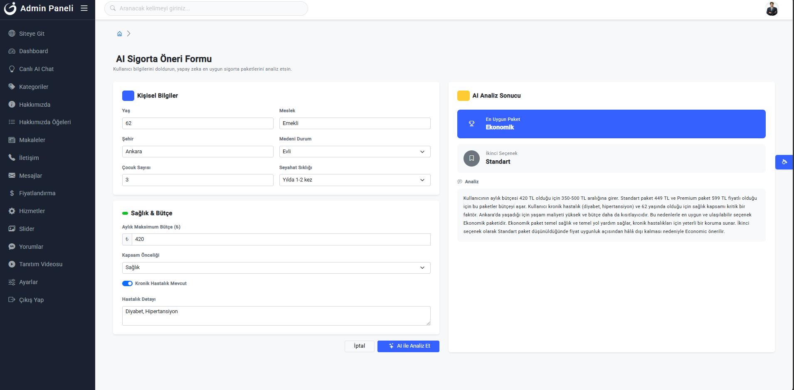
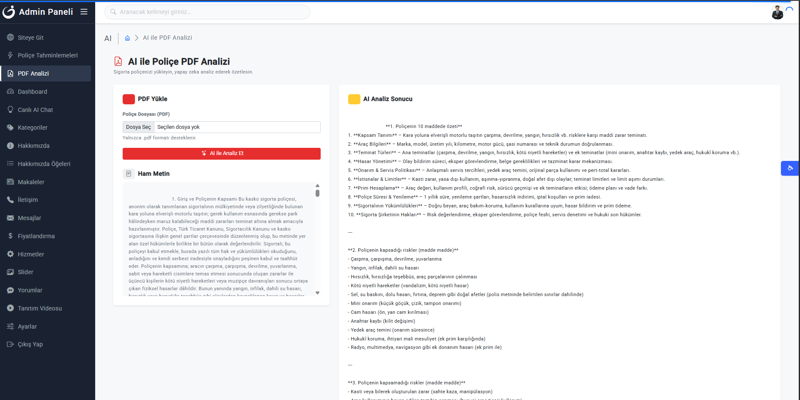
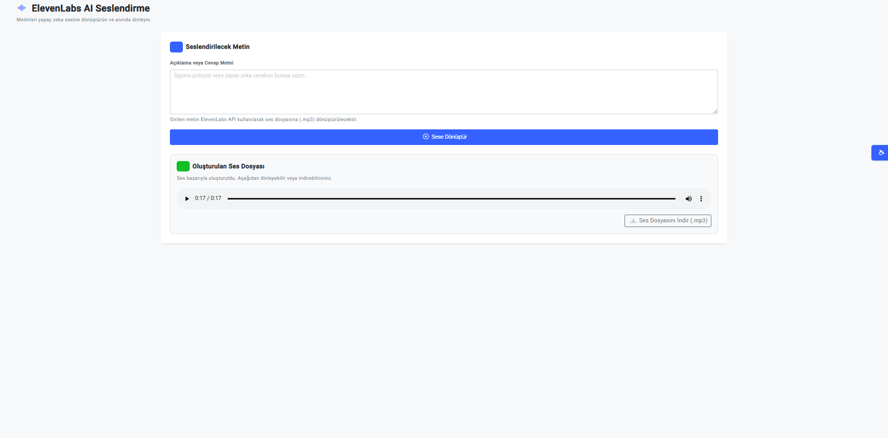
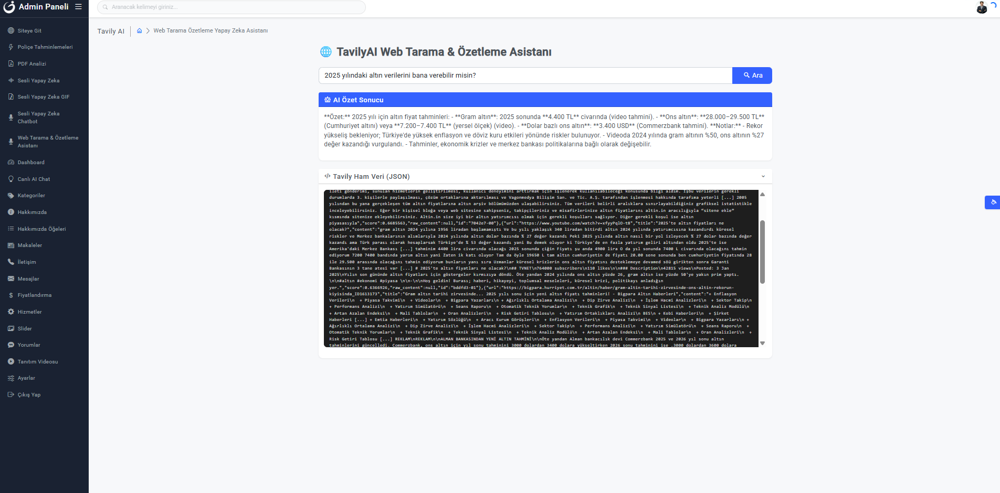
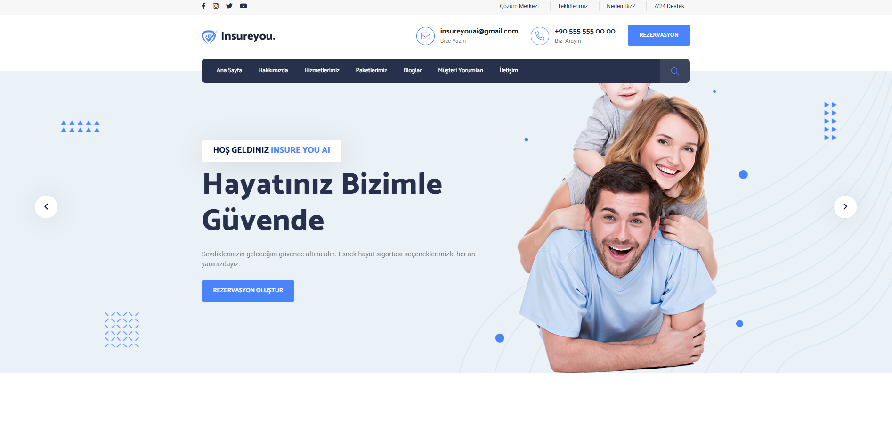
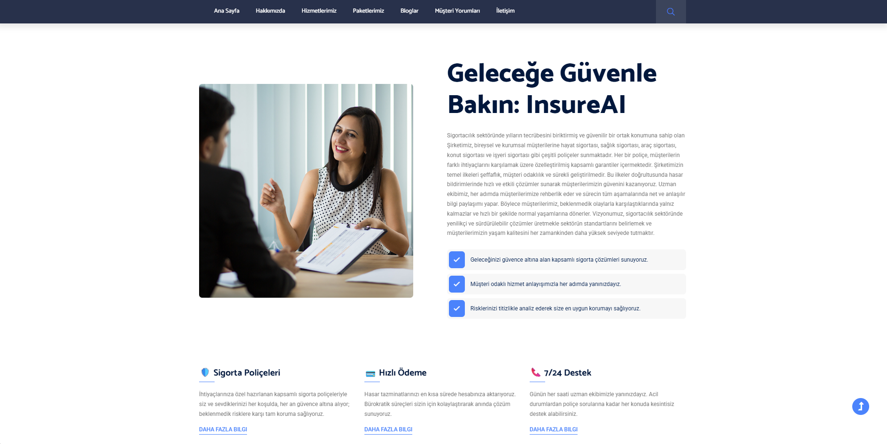
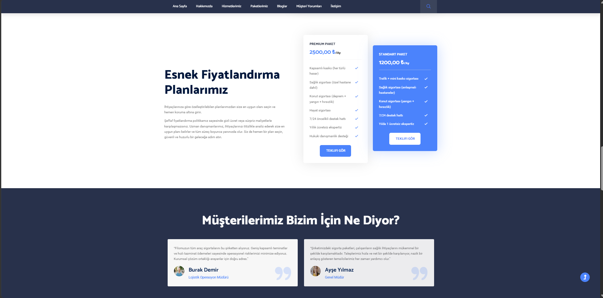
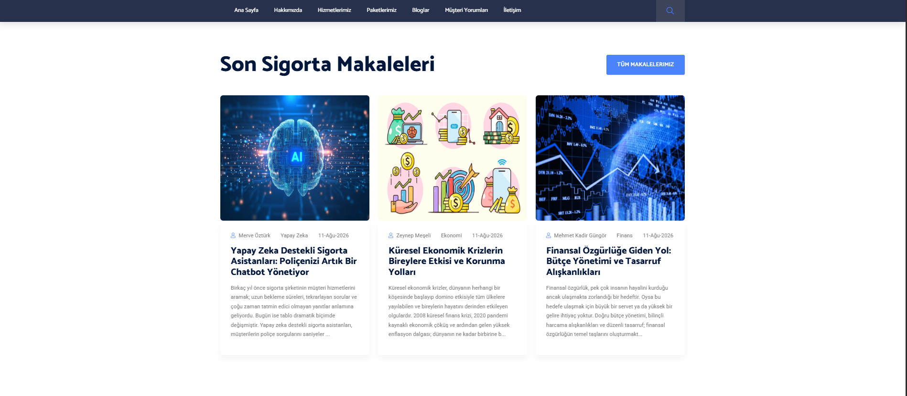
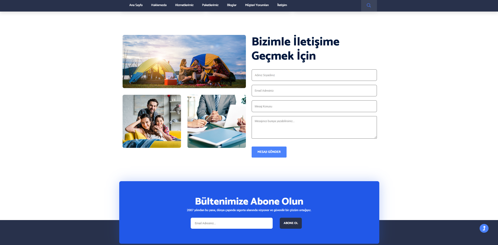
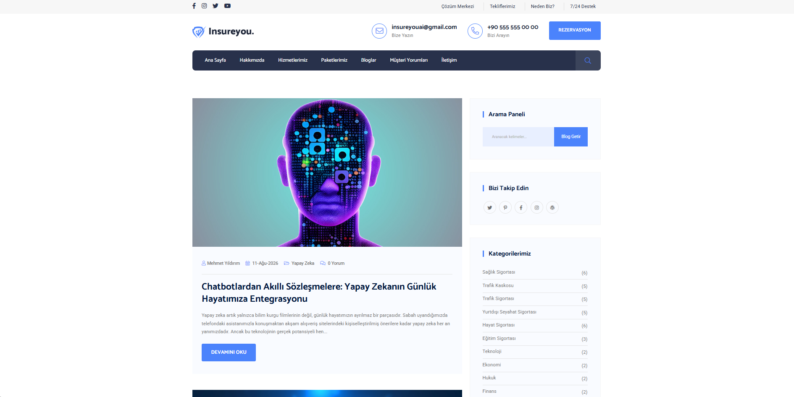
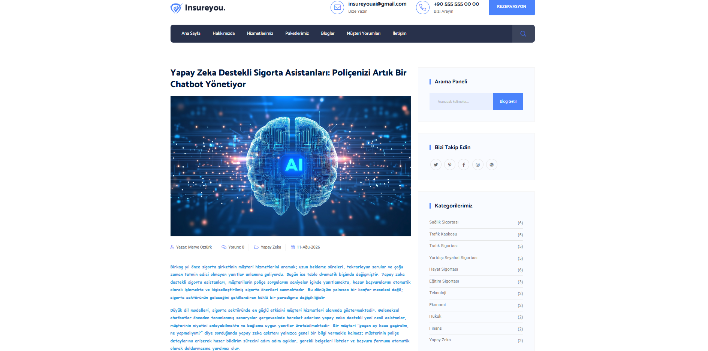
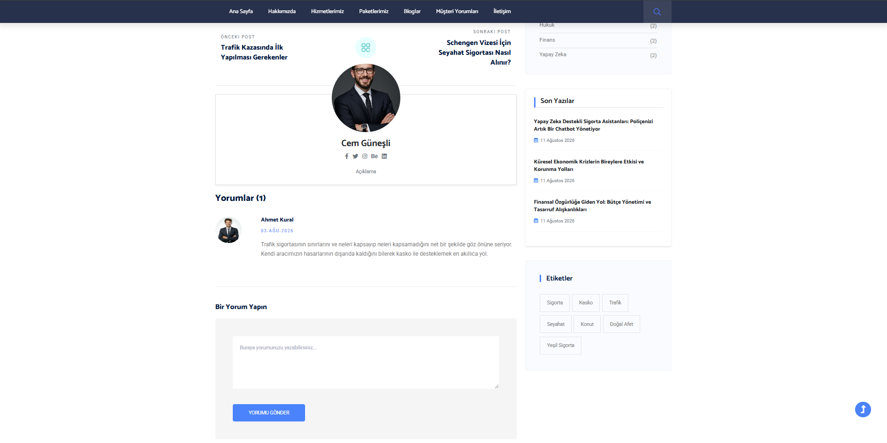
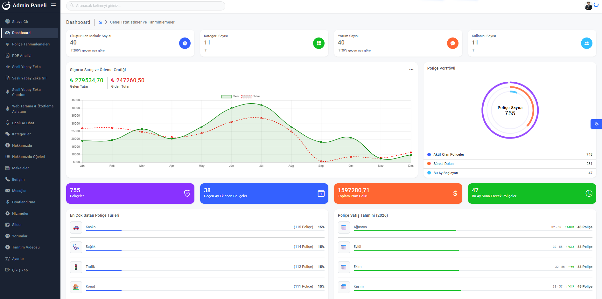
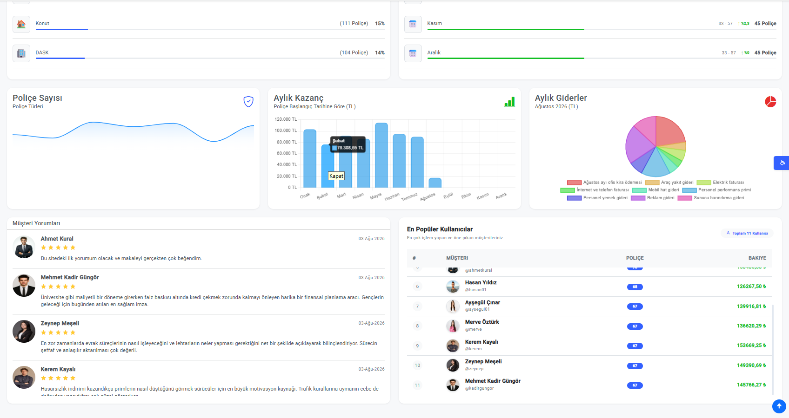
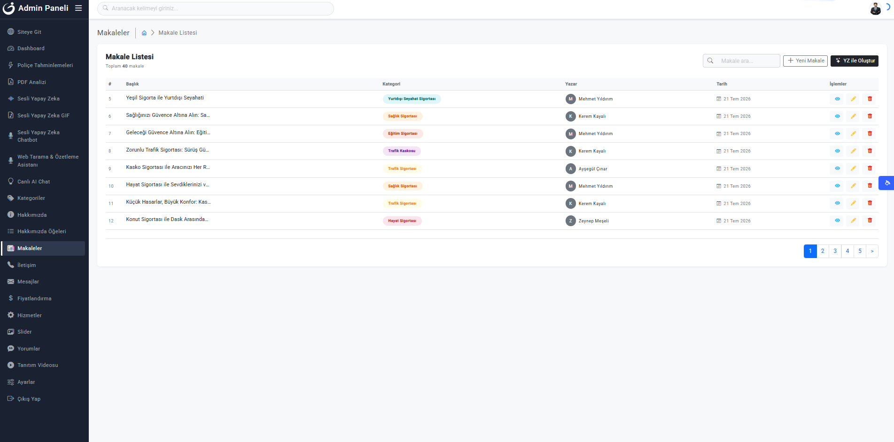
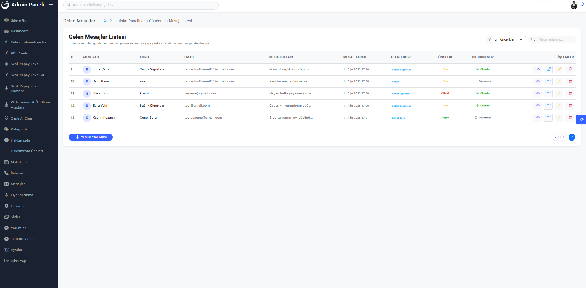
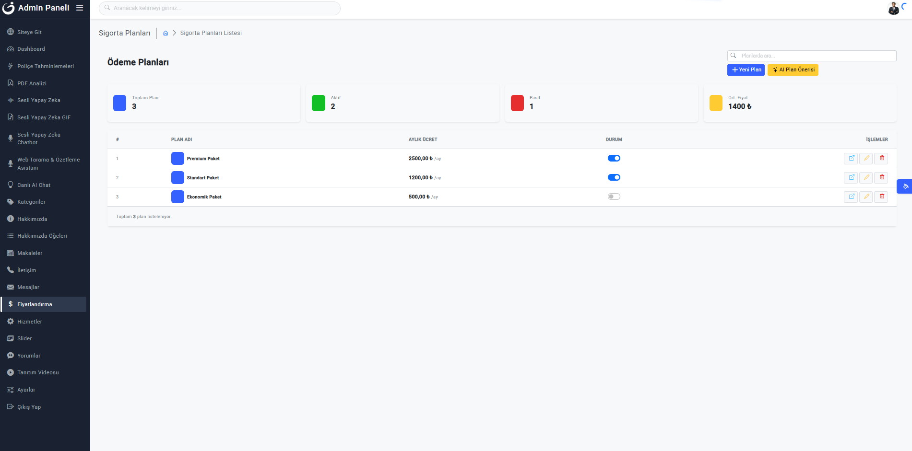
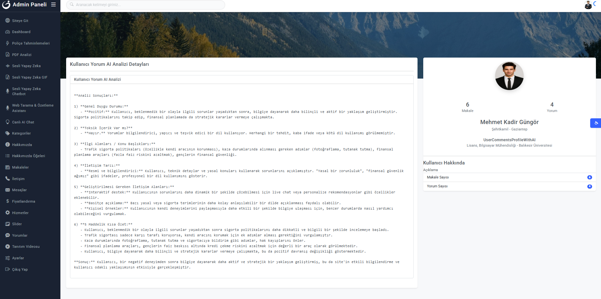
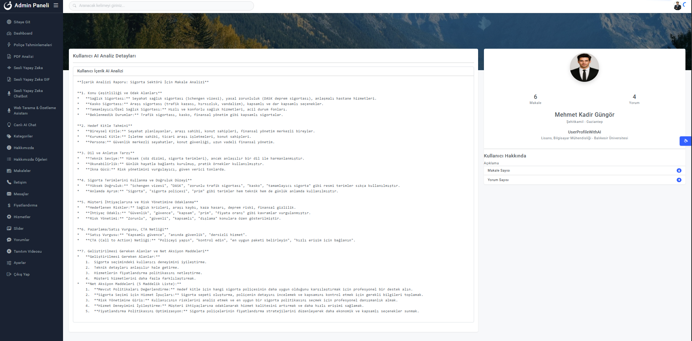
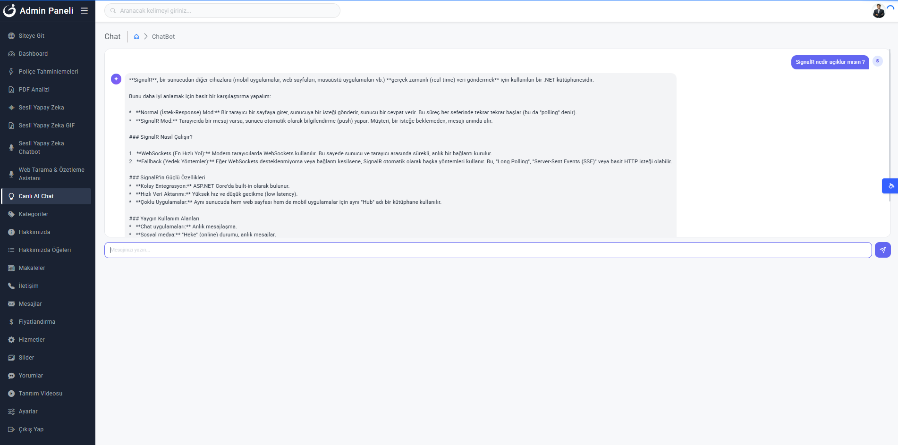
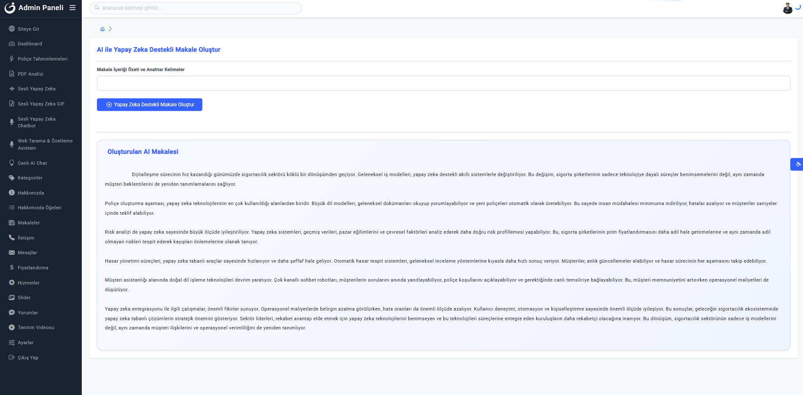

*Tam ekran görüntüleri için `screenshots` klasörü içinde ilgili resim dosyalarını açınız.*

---
